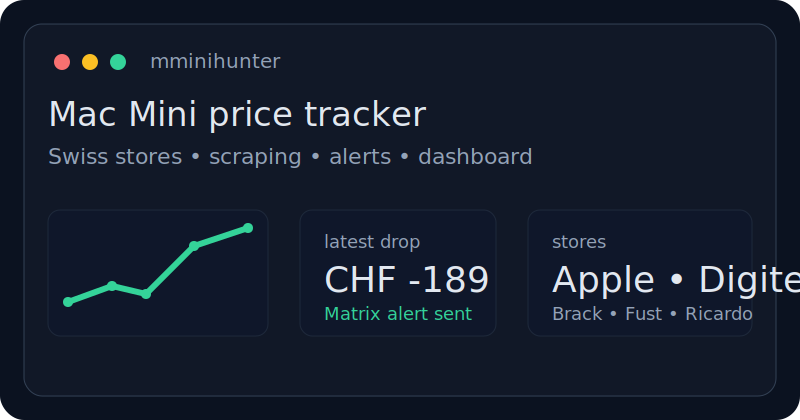
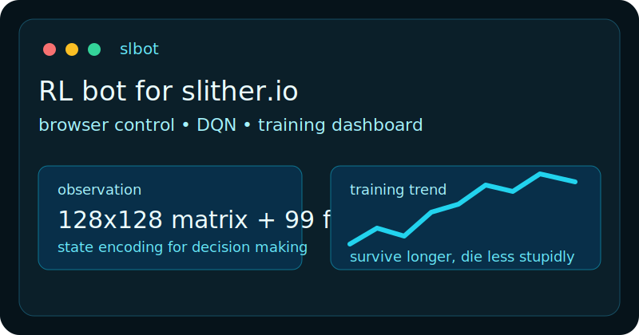
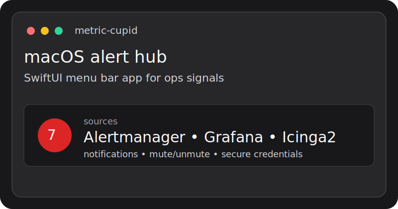
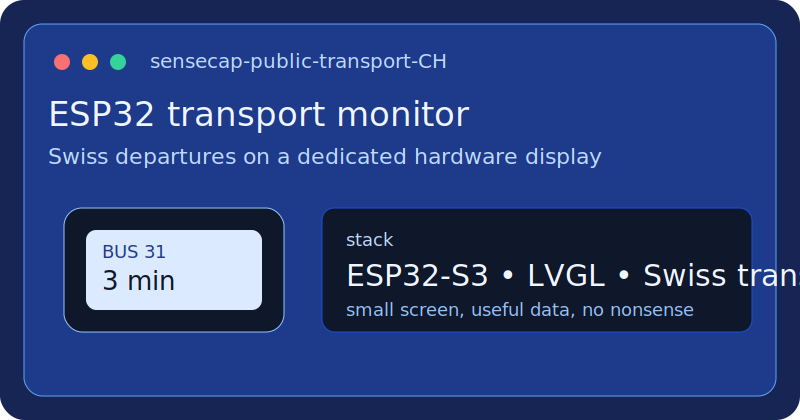

# dzaczek
  
```text
> linux,building trackers, bots, dashboards and weirdly specific tools
```

Backend, automation, scraping, embedded side quests, and systems that should be easy to debug at 03:00.

## `whoami`

- linux engineer / linux admin
- shepherd of tux
- based in Switzerland
- interested in Python, JavaScript/TypeScript, Swift, Rust, SQL, and ESP32 projects
- usually building monitoring tools, scrapers, dashboards, bots, and internal utilities

## `ls ~/current`

- `mminihunter` - Mac Mini M4 / M4 Pro price tracker for Swiss retailers with alerts and dashboard
- `slbot` - reinforcement learning bot that learns to play `slither.io` in a real browser
- `metric-cupid` - native macOS menu bar app for Alertmanager, Grafana, and Icinga2 alerts
- `sensecap-public-transport-CH` - ESP32-S3 public transport monitor for Swiss departures

## `gallery`

<a href="https://github.com/dzaczek/mminihunter">
  
</a>
<a href="https://github.com/dzaczek/slbot">
  
</a>
<a href="https://github.com/dzaczek/metric-cupid">
  
</a>
<a href="https://github.com/dzaczek/sensecap-public-transport-CH">
  
</a>

## `cat /etc/toolbox`

```bash
python
typescript
swift
rust
postgresql
docker
linux
esp32
web scraping
monitoring
automation
```

## `status`

- building small focused systems instead of bloated platforms
- automating repetitive work whenever possible
- interested in observability, data collection, and practical AI experiments
- partial to terminals, clean CLIs, and software with sharp edges

## `pinned`

- [mminihunter](https://github.com/dzaczek/mminihunter)
- [slbot](https://github.com/dzaczek/slbot)
- [metric-cupid](https://github.com/dzaczek/metric-cupid)
- [sensecap-public-transport-CH](https://github.com/dzaczek/sensecap-public-transport-CH)

## `contact`

- GitHub: [@dzaczek](https://github.com/dzaczek)
