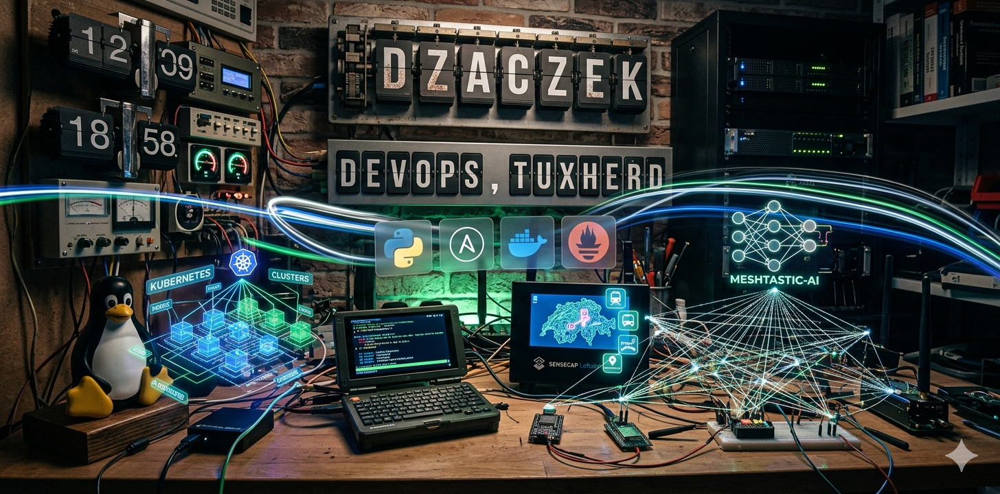

# dzaczek

**Linux engineer · Tuxherd**

[Gallery](#gallery) · [Projects](#projects)

## `whoami`

I'm a Linux engineer. I build monitoring and automation tools,
native macOS apps, and hardware projects that connect software to the world outside
my terminal.

My projects range from Grafana panels and alerting integrations to thermal cameras,
ESP32 displays, mesh radio and practical AI experiments. I like useful tools with
clear controls, readable data, and enough visibility to debug them at 03:00.

## Projects in pictures

<table>
  <tr>
    <td width="50%" valign="top">
      <a href="https://github.com/dzaczek/grafana-splitflap-panel">
        
         <strong>Grafana Split-Flap</strong>
      </a>
       Metrics on a mechanical departure board.
    </td>
    <td width="50%" valign="top">
      <a href="https://github.com/dzaczek/grafana-alpine-clock-panel">
        
         <strong>Grafana Alpine Clock</strong>
      </a>
       A clock face you can build and customise.
    </td>
  </tr>
  <tr>
    <td width="50%" valign="top">
      <a href="https://github.com/dzaczek/t2s-thermal-macos">
        
         <strong>T2S+ Thermal Camera</strong>
      </a>
       Thermal measurements and recording on macOS.
    </td>
    <td width="50%" valign="top">
      <a href="https://github.com/dzaczek/IcingaAlertingForge">
        
         <strong>Icinga Alerting Forge</strong>
      </a>
       Grafana alerts connected to Icinga2.
    </td>
  </tr>
  <tr>
    <td width="50%" valign="top">
      <a href="https://github.com/dzaczek/lovelace-flip-clock-card">
        
         <strong>Home Assistant Flip Clock</strong>
      </a>
       A mechanical flip clock for your dashboard.
    </td>
    <td width="50%" valign="top">
      <a href="https://github.com/dzaczek/Uconsole-i3">
        
         <strong>uConsole + i3</strong>
      </a>
       A Linux workspace on a handheld computer.
    </td>
  </tr>
  <tr>
    <td width="50%" valign="top">
      <a href="https://github.com/dzaczek/sensecap-public-transport-CH">
        
         <strong>SenseCAP Transport</strong>
      </a>
       Live transport departures on an ESP32 display.
    </td>
    <td width="50%" valign="top">
      <a href="https://github.com/dzaczek/icinga-lighthouse">
        
         <strong>Icinga Lighthouse</strong>
      </a>
       Hardware notifications for Icinga2.
    </td>
  </tr>
  <tr>
    <td width="50%" valign="top">
      <a href="https://github.com/dzaczek/slbot">
        
         <strong>slbot</strong>
      </a>
       Reinforcement learning in a real browser.
    </td>
    <td width="50%" valign="top">
      <a href="https://github.com/dzaczek/MacMiniHunter">
        
         <strong>MacMiniHunter</strong>
      </a>
       Mac mini price tracking across retailers.
    </td>
  </tr>
  <tr>
    <td width="50%" valign="top">
      <a href="https://github.com/dzaczek/Meshtastic-AI-Bridge">
        
         <strong>Meshtastic AI Bridge</strong>
      </a>
       Mesh radio, AI and Matrix in one interface.
    </td>
    <td width="50%" valign="top">
      <a href="https://github.com/dzaczek/HolidayPlanner">
        
         <strong>HolidayPlanner</strong>
      </a>
       Family holiday planning across districts.
    </td>
  </tr>
</table>

## Selected projects

| Project | What it does |
| --- | --- |
| [Icinga Alerting Forge](https://github.com/dzaczek/IcingaAlertingForge) | Bridges Grafana alerts into Icinga2 with automatically managed services and alert context. |
| [Grafana Split-Flap](https://github.com/dzaczek/grafana-splitflap-panel) | Displays metrics as a mechanical airport-style departure board. |
| [Grafana Alpine Clock](https://github.com/dzaczek/grafana-alpine-clock-panel) | A configurable clock panel with independent hands, indices and dial controls. |
| [T2S+ Thermal Camera](https://github.com/dzaczek/t2s-thermal-macos) | Native macOS thermal measurements, recording and a virtual camera. |
| [AI Headset](https://github.com/dzaczek/AI-Headset) | A virtual macOS audio device that connects an ElevenLabs conversational agent to calls. |
| [AVA](https://github.com/dzaczek/ava) | A multilingual AI phone assistant with Signal updates and mid-call instructions. |
| [slbot](https://github.com/dzaczek/slbot) | A reinforcement-learning experiment that plays slither.io in a real browser. |
| [MacMiniHunter](https://github.com/dzaczek/MacMiniHunter) | Tracks Mac mini prices across retailers. |
| [Meshtastic AI Bridge](https://github.com/dzaczek/Meshtastic-AI-Bridge) | Connects Meshtastic, AI and Matrix through a web interface. |
| [SenseCAP Transport](https://github.com/dzaczek/sensecap-public-transport-CH) | Live bus and train departures on an ESP32-S3 SenseCAP Indicator. |
| [FacePulse](https://github.com/dzaczek/facepulse) | Raspberry Pi face-presence tracking with Prometheus metrics and Grafana dashboards. |
| [nftgeo](https://github.com/dzaczek/nftgeo) | A small declarative geographic firewall for nftables on Linux. |

Also on my workbench: Home Assistant [flip clocks](https://github.com/dzaczek/lovelace-flip-clock-card)
and [sensor counters](https://github.com/dzaczek/lovelace-flip-sensor-card),
[i3 on the uConsole](https://github.com/dzaczek/Uconsole-i3),
[HolidayPlanner](https://github.com/dzaczek/HolidayPlanner), and
[MATH-PAC](https://github.com/dzaczek/MATH-PAC).

[Metric Cupid](https://github.com/dzaczek/metric-cupid-feedback) has a public feedback
and issue tracker; its application source is private.

## `cat /etc/toolbox`

**Systems & observability:** Linux, Docker, Kubernetes, Ansible, Prometheus, Grafana, Icinga2.

**Code & data:** Python, Go, Swift, JavaScript / TypeScript, Bash, SQL.

**Hardware & experiments:** ESP32, Raspberry Pi, thermal imaging, Meshtastic, Home Assistant, AI and automation.

## Around the web

[All repositories](https://github.com/dzaczek?tab=repositories) ·
[Buy me a coffee](https://buymeacoffee.com/dzaczek)

For questions, ideas or bug reports, open an issue in the relevant project.
